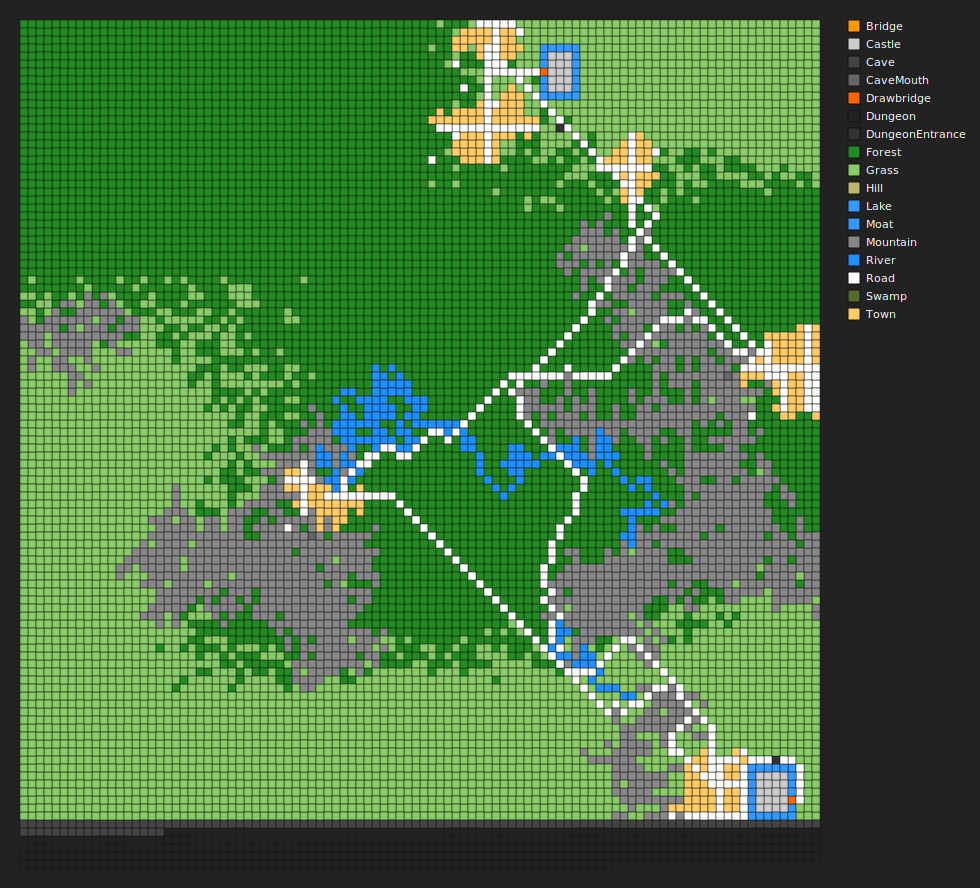

# PhotonMUD: Complete Game Rules Reference

You awaken startled, your head throbbing and your memories a haze.

The ground beneath you is cold, and the air carries the scent of distant
fires, damp earth, and adventure. You have no recollection of how you
arrived in this strange land, nor what fate brought you here. All you
possess are your wits, a few belongings, and a sense that something
important has been set in motion.

Around you, the world stirs: the echo of footsteps in ancient halls,
the whisper of wind through forgotten forests, the clang of steel and
the murmur of magic. Somewhere, heroes rise and fall, treasures await
discovery, and secrets lie buried in shadow.

You are not alone. Others wander these lands—some friend, some foe.
Your journey begins now, shaped by your choices, your courage, and the
path you carve through the unknown.

Will you become a legend, or just another lost soul in the annals of
this realm?

Welcome to PhotonMUD...

  

The image is a visual map showing an example of a procedurally generated world. Each symbol or color on the map represents a different type of room or feature—such as towns, castles, dungeons, caves, rivers, shops, banks, and more. Lines or paths between rooms show how you can travel from one place to another. This map gives you an example of how a world could be laid out, how locations could be connected, and where important landmarks or adventure sites could be found. As you explore in-game. No two campaigns are alike!
---

## Introduction

**PhotonMUD is a living, persistent, procedurally generated realm.**  
Every world is unique: the landscape, towns, castles, dungeons, caves, rivers, and even the monsters and treasures you encounter are created anew for each realm. No two adventures are ever the same.

Your journey is to **explore the unknown**, **battle monsters and rivals**, and **climb the ranks** to become the most powerful adventurer of your kind.  
You will uncover secrets, gather loot, master spells, and leave your mark on a world that remembers your deeds.  
Whether you seek glory, riches, or simply the thrill of discovery, PhotonMUD offers a dynamic world where your actions shape your legend.

---

## Quick Start: How to Play

- **Type commands at the prompt** (e.g., `N`, `LOOK`, `ATTACK GOBLIN`, `INVENTORY`).
- **Explore** a vast, persistent world with towns, castles, dungeons, caves, rivers, swamps, hills, and more.
- **Fight monsters** and other players to gain experience, loot, and fame.
- **Level up** to grow stronger, learn new spells, and unlock abilities.
- **Interact** with other players: chat, trade, group up, or compete.
- **Use HELP** at any time for command details or context help.
- **Your actions matter:** The world is persistent and changes as players and monsters act.

---

## Character Creation & Stats

- **Choose a name, race, and class** (Fighter, MagicUser, Thief, Cleric, Druid, etc.).
- **Stats:**  
    - **STR** (Strength): Melee damage and attack rolls.
    - **INT** (Intelligence): MagicUser spellcasting.
    - **WIS** (Wisdom): Cleric/Druid spellcasting.
    - **DEX** (Dexterity): Initiative, ranged attacks, defense.
    - **PIE** (Piety): Divine magic and resistances (PhotonMUD addition).
    - **CHA** (Charisma): Charm/beguile, shop prices.
    - **CON** (Constitution): HP gain per level.
    - **LUCK** (Luck): Influences random events, item discovery, and critical hits.
- **Stat Rolling:**  
    - Stats are rolled (4d6 drop lowest), with class/race bias. Prime stats for your class are favored.
- **Proficiency:**  
    - Choose a weapon type for bonus accuracy and damage. Proficiency gives +2 to hit and damage with that weapon.
- **Alignment:**
    - Choose your character's ethical and moral alignment, affecting certain spells and interactions.

---

## Races & Classes

- **Races:**  
    - **Human**: Versatile, with minor bonuses to most stats.
    - **Elf**: +1 INT, +1 WIS, +1 DEX, +0 CON, +0 PIE, +1 CHA.
    - **Dwarf**: +1 STR, +0 INT, +0 WIS, +0 DEX, +2 CON, +0 PIE, -1 CHA.
    - **Halfling**: +0 STR, +0 INT, +1 WIS, +2 DEX, +0 CON, +0 PIE, +1 CHA.
    - **Half-elf**: +0 STR, +1 INT, +1 WIS, +1 DEX, +0 CON, +0 PIE, +1 CHA.
    - **Half-orc**: +2 STR, -2 INT, -1 WIS, +0 DEX, +1 CON, -1 PIE, -2 CHA.
    - **Ogre**: +3 STR, -2 INT, -2 WIS, -1 DEX, +2 CON, -2 PIE, -3 CHA.
    
- **Classes:**  
    - **Fighter**: High HP, STR-focused, weapon specialists.
    - **MagicUser**: Low HP, INT-focused, powerful offensive spells.
    - **Thief**: Medium HP, DEX-focused, special abilities like picklock.
    - **Cleric**: Medium-high HP, WIS/PIE-focused, healing and divine magic.
    - **Paladin**: High HP, STR/PIE-focused, limited divine magic.
    - **Ranger**: Medium-high HP, DEX/STR-focused, nature-oriented.
    - **Druid**: Medium HP, WIS/PIE-focused, nature and elemental magic.

---

## Attributes & Modifiers

- **Stat Modifiers:**  
    - Every 2 points above 10: +1 bonus.
    - Every 2 points below 10: -1 penalty.

| Stat Value | Modifier |
|------------|----------|
| 3–4        | -3       |
| 5–6        | -2       |
| 7–8        | -1       |
| 9–12       | 0        |
| 13–14      | +1       |
| 15–16      | +2       |
| 17–18      | +3       |

- **Initiative:**  
    - Each combatant rolls 1d20 + DEX modifier at the start of combat. Highest goes first.
- **Attack:**  
    - Melee: 1d20 + average of STR/DEX modifiers + weapon/proficiency/magic bonuses vs. target AC.
    - Ranged: 1d20 + DEX modifier + bonuses.
- **Defense (Armor Class):**  
    - AC is improved by armor, shield, DEX, and magic.
    - Shields and defensive actions can further reduce damage.
- **Blessings & Curses:**
    - Characters can be blessed or cursed, affecting their luck stat.
    - Blessings increase luck by 2 for one hour.
    - Curses decrease luck by 2 for one hour.
    - Use FIX to remove all curses and blessings.

---

## Dice Rolls & Bonuses Reference

### Initiative

| Action      | Dice Roll                | Bonus Applied         |
|-------------|--------------------------|----------------------|
| Initiative  | 1d20                     | DEX modifier         |

### Attacks

| Attack Type | Dice Roll                | Bonus Applied                                  | Notes                                   |
|-------------|--------------------------|------------------------------------------------|-----------------------------------------|
| Melee       | 1d20                     | AVG(STR, DEX) modifier + weapon + proficiency + magic | vs. target AC                          |
| Ranged      | 1d20                     | DEX modifier + weapon + proficiency + magic    | vs. target AC                          |
| Lunge       | 1d20 - 2                 | STR/DEX + weapon + proficiency + magic         | Damage: 2d6+bonuses or weapon dice     |
| Thrust      | 1d20 - 1                 | DEX + weapon + proficiency + magic             | Damage: 2d5+bonuses or weapon dice     |
| Backstab    | 1d20                     | DEX + weapon + proficiency + magic             | Thief only, Damage: 3d8+bonuses        |
| Charge      | 1d20 - 2                 | STR + weapon + proficiency + magic             | Damage: 2d6+bonuses or weapon dice     |
| Pummel      | 1d20                     | STR + weapon + proficiency + magic             | Multiple light hits                    |
| Feint       | 1d20 - 1                 | DEX + weapon + proficiency + magic             | Reduces opponent's defense             |
| Beat        | 1d20 - 1                 | STR + weapon + proficiency + magic             | Balanced attack                        |

#### Weapon Damage Dice Table

| Weapon Type         | Dice   |
|---------------------|--------|
| Longsword, Broadsword, Bastard Sword, Greatsword | 1d8   |
| Shortsword, Scimitar, Cutlass, Rapier            | 1d6   |
| Mace, Club, Flail, Morningstar                   | 1d6   |
| Dagger, Knife, Stiletto                          | 1d4   |
| Halberd, Glaive, Polearm                         | 1d10  |
| Battleaxe, Greataxe                              | 1d8   |
| Handaxe, Hatchet                                 | 1d6   |
| Spear, Trident                                   | 1d8   |
| Bow, Crossbow, Longbow, Shortbow                 | 1d8   |
| Sling, Stone, Rock                               | 1d4   |
| Fist, Hand, Unarmed, Punch, Kick                 | 1d3   |
| Default                                          | 1d4   |

#### Proficiency Bonus Table

| Weapon Used      | If Proficient | If Not Proficient |
|------------------|--------------|-------------------|
| Any              | +2 to hit and damage | 0           |

#### Magic Weapon Bonus

- Magic weapons add their bonus (e.g., +1, +2) to both attack and damage rolls.

#### Armor & Shields

| Equipment      | Bonus/Effect                |
|----------------|----------------------------|
| Armor          | Improves AC (varies by type)|
| Shield         | Improves AC, enables SHIELD action (halve next damage) |

---

## Proficiency & Equipment

- **Weapon Proficiency:**  
    - Using your chosen weapon type gives +2 to attack and damage.
    - Non-proficient weapons can be used, but without the bonus.
    - Available proficiencies: Sword, Axe, Mace, Dagger, Bow, Sling, Polearm, Unarmed.
- **Magic Weapons:**  
    - Add their bonus to attack and damage.
- **Weapon Damage:**  
    - Each weapon has specific dice (see table above).
- **Armor & Shields:**  
    - Reduce damage and improve AC. Shields can be used for special defensive actions.
- **Equipment Management:**  
    - Use EQUIP, WEAR, REMOVE, RETURN, SORT, LOOKIN, etc. to manage gear.
    - Items can be stored in containers (chests, bags, etc.).
- **Item Identification:**  
    - Use IDENTIFY to reveal magical properties or special effects.
- **Equipment Slots:**
    - Weapon, armor, shield, and accessory slots for equipping items.
    - Some items occupy specific slots or multiple slots.

---

## Movement & Exploration

- **Move:**  
    - Use N, S, E, W, NE, NW, SE, SW, U, D, IN, OUT to move between rooms.
    - Some exits may be hidden or require special actions (SEARCH, ENTER, GO, or USE).
- **LOOK:**  
    - See your current room or a direction. Descriptions may reveal clues or hidden features.
    - LOOK <direction> to examine a potential exit.
    - LOOK <object> to examine an object or feature in the room.
    - LOOK <player/monster> to examine another character.
- **SEARCH:**  
    - Find hidden objects, doors, or features. Some secrets require high stats or luck.
- **MAP:**  
    - View your surroundings, including all new features (e.g., Bank, Plaza, Tower, Dungeon, Cave, Shop, Inn, Temple, etc.).
    - The map legend is always up-to-date with new features.
- **BRIEF/VERBOSE:**  
    - Toggle room description detail for faster navigation or more immersion.
- **Dynamic Exits:**  
    - Some rooms have context-sensitive exits or require solving puzzles to proceed.
    - Use ENTER, GO, or USE with object names to interact with potential exits.
- **Taming & Mounts:**
    - Tame creatures using the TAME command, then MOUNT them for faster travel.
    - Taming requires charisma checks and may vary by creature type.
    - DISMOUNT to get off your mount.
- **Boats & Water:**
    - BOARD a boat, then SAIL in a direction to travel over water.
    - DISMOUNT to exit a boat.

---

## Objects, Treasures, and Inventory

- **Objects:**  
    - Weapons, armor, potions, scrolls, containers, keys, and special items.
    - Each object has weight, value, and may have magical properties or effects.
- **Treasures:**  
    - Found in rooms, dropped by monsters, or hidden in containers.
    - Some treasures are unique or required for quests.
- **Inventory:**  
    - Use INVENTORY (I) to view your items.
    - Use GET/TAKE, DROP, PUT, EQUIP, WEAR, REMOVE, RETURN, SORT, LOOKIN to manage items.
    - Containers can hold other items; some may be locked or trapped.
    - Use SORT to organize your inventory by item type.
- **Identify:**  
    - Use IDENTIFY <item> to learn about magical or special properties.
- **Use:**  
    - Use consumables (potions, scrolls, etc.) for effects. Some items may have limited charges.
    - EAT and DRINK commands for food and beverages.
    - LIGHT for light sources, FUEL to refill them.
- **Containers:**
    - OPEN, CLOSE, LOCK, and UNLOCK containers.
    - PUT items IN containers.
    - GET items FROM containers.
    - LOOKIN containers to see contents.
    - Thieves can PICKLOCK locked containers.

---

## Combat System

### Turn Order

- **Initiative:**  
    - Each participant rolls 1d20 + DEX modifier. Highest acts first. Ties are broken by DEX, then randomly.
    - In group combat, initiative is rolled for each participant individually.

### Monster Level Engagement

- **Monster Engagement:**
    - Monsters will generally only engage players within a certain level range.
    - Higher-level monsters will ignore players who are too weak.
    - This range scales with monster level (approximately ±2 levels for low-level monsters, increasing for higher-level monsters).
    - Monsters may taunt players who are too weak to fight instead of attacking.

### Actions (On Your Turn)

| Action      | Dice Roll / Effect                        | Bonus/Notes                                 |
|-------------|-------------------------------------------|---------------------------------------------|
| Attack      | 1d20 + bonuses vs. AC                     | Weapon/monster dice for damage              |
| Lunge       | 1d20 - 2 to hit, 2d6+bonuses damage       | Or weapon/monster dice if higher            |
| Thrust      | 1d20 - 1 to hit, 2d5+bonuses damage       | Or weapon/monster dice if higher            |
| Backstab    | 1d20 to hit, 3d8+bonuses damage           | Thief only, or weapon/monster dice if higher|
| Charge      | 1d20 - 2 to hit, 2d6+bonuses damage       | Or weapon/monster dice if higher            |
| Pummel      | 1d20 to hit, multiple light hits          | Faster, multiple attacks                    |
| Feint       | 1d20 - 1 to hit, reduces opponent defense | Sets up advantage for next attack           |
| Beat        | 1d20 - 1 to hit, balanced attack          | Good all-around attack                      |

#### Defensive Actions

| Action   | Effect                                 |
|----------|----------------------------------------|
| Dodge    | 50% chance to avoid all next damage    |
| Parry    | Halve next damage                      |
| Guard    | Reduce next incoming damage by 2       |
| Shield   | Halve next damage (if shield equipped) |
| Counter  | Reflect half of next damage            |

#### Special Actions

| Action   | Dice/Effect                       | Notes                        |
|----------|-----------------------------------|------------------------------|
| Charm    | d20 + CHA > 18                    | Target loses next turn       |
| Beguile  | d20 + CHA > 16                    | Target confused              |
| Talk     | Say something to your opponent    |                              |
| Run      | d20 + DEX - opponent level > 10   | Escape combat, may provoke attack |

#### Criticals & Fumbles

| Roll | Effect                |
|------|-----------------------|
| 20   | Critical hit (double damage) |
| 1    | Fumble (automatic miss)      |

### Group Combat

- **Party System:**
    - Form parties with other players using PARTY INVITE.
    - Accept invitations with PARTY ACCEPT.
    - Communicate with party members using PARTY SAY.
    - View party members with PARTY LIST.
    - Leave a party with PARTY LEAVE.
- **Group Combat:**
    - Multiple players can join combat against monsters or other players.
    - Turn order is determined by individual initiative rolls.
    - Alliances can form during combat (even with monsters).
    - Betrayal is possible but risky.

### Dice Rolls

- **All dice rolls are random and shown in combat logs.**
- **Weapon and monster dice are used for damage, e.g., 2d8+4 for ogres.**
- **Bonuses are always displayed in combat messages.**
- **Critical hits and fumbles:** Natural 20 is a critical hit (double damage), natural 1 is a fumble (automatic miss).

### XP Calculations

- **Experience is based on opponent level with modifiers:**
    - +20% per level above you
    - -10% per level below you (minimum 10% of base)
    - +50% bonus for player vs. player combat
    - Minimum 5 XP per victory

### Combat End

- **Victory:**  
    - Reduce opponent's HP to 0 to win and gain XP and loot.
- **Defeat:**  
    - If your HP drops to 0, you die and may lose items or gold, but will respawn at a safe location.
- **Escape:**  
    - Successfully running moves you several rooms away and ends combat.

---

## Monsters & Encounters

- **Monsters:**  
    - Each has a unique name, level, HP, AC, attack dice, and bonus.
    - Monster damage dice and bonuses are D&D-style.
    - Some monsters have special abilities (poison, spells, rust, steal, psionics, etc.).
    - Boss monsters are persistent and tracked across sessions.
- **Monster AI:**  
    - Monsters act on their own initiative, choosing actions based on HP, level, and situation.
    - AI supports group tactics, taunts, bribes, and can target the weakest or most dangerous player.
    - Monsters will generally only engage players within their level range (typically ±2-3 levels).
    - Monsters may taunt players who are too weak to fight.
- **Monster Placement:**  
    - Monsters are placed by an AI daemon using region/feature-based quotas and fallback logic for thematic but robust distribution.
    - Room restrictions: max monsters per room, no duplicate names, region/feature matching.
    - Bosses are placed in special landmark rooms and tracked for defeat/persistence.
- **Group Combat:**  
    - Multiple players can join a fight. Each participant rolls initiative and acts in order.
    - Monsters may call for help or flee if outmatched.
- **Monster Reactions:**
    - Some monsters can be bribed with gold using the BRIBE command.
    - Others may respond to TALK or PARLEY.
    - Monster reactions often depend on their type and the player's charisma.
- **Respawn:**  
    - Monsters respawn unless marked defeated (bosses tracked in persistence).
    - Some rare monsters or bosses do not respawn until the next world reset.
- **Taming:**
    - Some monster types can be tamed using the TAME command.
    - Taming success depends on monster type, player level, and charisma.
    - Tamed monsters become mounts that players can ride using MOUNT.

---

## Magic & Spells

- **Spellcasters:**  
    - MagicUser, Cleric, and Druid classes can learn and cast spells.
    - Paladin and Ranger have limited spellcasting abilities at higher levels.
- **Spell Categories:**
    - **Healing & Protection**: Vigor, Heal, Cure Poison, Bless, Shield, etc.
    - **Offensive**: Magic Missile, Fireball, Lightning Bolt, Ice Storm, etc.
    - **Utility**: Light, Darkness, Identify, Detect Trap, Invisibility, etc.
    - **Divine**: Turn Undead, Divine Favor, Smite, Resurrection, etc.
    - **Nature**: Entangle, Animal Friend, Call Lightning, Weather Control, etc.
    - **Psionic**: Mind Blast, Mind Shield, Telepathy, Telekinesis, etc.
- **Spellbook:**  
    - View your known spells with SPELLBOOK or SPELLS.
    - Spells are organized by category for easier reference.
    - Shows spell slots used and available.
- **Casting:**  
    - Use CAST <spell> [AT <target>] to cast spells. Some spells require a target, others affect yourself or the room.
    - Casting uses spell slots that regenerate when resting at an Inn.
    - Spell chants appear when casting for immersion.
- **Learning:**  
    - Gain new spells automatically when leveling up as a caster.
    - Learning chance is based on INT for Magic-Users or WIS for Clerics/Druids.
    - Higher-level spells are harder to learn.
    - Use LEARN to attempt to learn a specific spell.
    - Use FORGET to remove a known spell.
- **Spell Ingredients:**
    - Some spells require specific ingredients that are consumed when casting.
    - Ingredients must be in your inventory to cast these spells.
- **Psionic Abilities:**
    - Mental powers that function like spells but use different mechanics.
    - Use PSIONIC <target> to attack another player or monster mentally.
    - Psionic attacks are based on INT and opposed by the target's WIS.
- **Magic Items:**
    - Scrolls allow casting spells not known by the character.
    - Potions provide spell effects when consumed.
    - Wands, staves, and other magic items may have charges that deplete with use.

---

## Leveling Up & Experience

| Class      | Hit Die | Stat Gain (per level) | Spell Gain (per level) |
|------------|---------|-----------------------|------------------------|
| Fighter    | 1d10    | +1 to prime stat (STR) most likely, random otherwise | None                   |
| Paladin    | 1d10    | +1 to STR/CON/PIE/CHA | Limited at higher levels|
| Ranger     | 1d8     | +1 to DEX/STR/CON/WIS | Limited at higher levels|
| MagicUser  | 1d4     | +1 to INT             | New spell most levels   |
| Thief      | 1d6     | +1 to DEX/STR/CHA     | None                   |
| Cleric     | 1d8     | +1 to PIE/WIS/CON     | New spell most levels  |
| Druid      | 1d6     | +1 to WIS/PIE/CON     | New spell most levels  |

- **HP Gain:** 1 + random(hit die) + CON modifier per level (minimum 1).
- **Stat Gain System:**
  - Roll 1d10:
    - 1-6: No stat gain
    - 7-8: Gain in prime stat (e.g., STR for Fighter, INT for Magic-User)
    - 9: Gain in random non-CON stat
    - 10: Gain in random stat
  - Stat increases capped at 18
- **XP Table:** Each class has a unique XP table. XP for monsters is level-based, with bonuses for special abilities.
- **Notifications:**  
    - All level-up gains are clearly announced, including stat increases and new spells.
    - Room notifications inform others when you level up.

---

## Economy & Inventory

| Action         | Dice/Bonus/Effect                   | Notes                                      |
|----------------|-------------------------------------|--------------------------------------------|
| Gold Found     | Varies by monster/treasure          | Some monsters/rooms have more gold         |
| Shop Prices    | Affected by CHA modifier            | Higher CHA = better prices                 |
| Market         | Player-driven, prices set by sellers| Market only in shops                       |
| Bank           | No dice, but gold is safe from loss | Use BANK, DEPOSIT, WITHDRAW                |
| Stealing       | d20 + DEX vs. target's DEX/level    | Thieves have bonuses                       |

- **Gold:**  
    - Earn gold from monsters, treasures, and trading.
    - Gold can be lost on death or stolen by monsters/thieves.
- **Bank:**  
    - Use BANK, DEPOSIT, and WITHDRAW to manage your gold safely at a Bank (feature 'Bank', symbol 'B' on map).
    - Gold in the bank is safe from loss on death.
- **Shops:**  
    - Buy and sell items in towns and markets. You must be in a shop to use the market.
    - Shop types include:
        - **Blacksmith/Armory**: Weapons and armor
        - **Magic Shop**: Magical items and scrolls
        - **Potion Shop/Alchemist**: Potions and elixirs
        - **Rare Goods Emporium**: Exotic and unique items
    - Shop inventories may change over time or after world resets.
- **Market:**  
    - Trade with other players using the market system (only in shops).
    - Use MARKET or MK to see available items.
    - Use MYMARKET or MM to see your listed items.
    - Use BUY <number> to purchase from the market.
    - Use SELL <item> <price> to list items for sale.
    - Use SELL TO SHOP to sell directly to the shopkeeper.
    - Prices may be affected by your CHA stat.
- **Trading:**
    - Use TRADE <player> <item/gold> [FOR <item/gold>] to propose trades.
    - Accept trades with TRADE ACCEPT <player>.
    - Decline trades with TRADE DECLINE <player>.

---

## Object & Treasure Effects

| Effect Type    | Dice/Bonus/Effect                   | Notes                                      |
|----------------|-------------------------------------|--------------------------------------------|
| Healing Potion | Restores 1d8+CON HP                 | Some potions heal more                     |
| Poison         | d20 + CON vs. DC or take damage     | Some monsters/weapons inflict poison       |
| Rust           | d20 + item quality vs. DC           | Rust monsters may destroy weapons/armor    |
| Steal          | d20 + DEX vs. target's DEX/level    | Thieves/monsters may steal items/gold      |
| Launchable     | Ammo-based, see item description    | Used for siege/vehicle weapons             |
| Edible         | May heal or harm, see item          | Some food is poisonous                     |
| Vehicle        | Special movement, see item/room     | Boats, wagons, etc.                        |
| Magic Items    | Various effects, see description    | May have charges, cooldowns, or limits     |

- **Bless/Curse:**
    - BLESS <item> to improve an item's properties.
    - CURSE <item> to curse an item (usually for testing or challenges).
    - FIX <item> to remove curses and restore damaged items.
- **Light Sources:**
    - LIGHT <item> to illuminate dark areas.
    - FUEL <item> WITH <fuel> to refill light sources.
    - Light spells provide illumination for a duration.

---

## Social & Multiplayer

- **Players:**  
    - See other players in your room using HERE command.
    - View all online players with USERS or WHO.
- **Chat:**  
    - Use a dot prefix (.) or SAY command to speak in your room.
    - Use /me or /emote for emotes and actions.
    - No global shout command - communication is local to maintain immersion.
- **Trade:**  
    - Exchange items and gold with other players using GIVE, TRADE, or DROP commands.
    - Formal trading system with TRADE <player> <item> FOR <item/gold>.
- **PvP:**  
    - Engage in player-vs-player combat using ATTACK <player>.
    - Combat works the same as monster fights, with initiative and turns.
    - Players get 50% bonus XP for defeating other players.
- **Group Combat:**  
    - Join ongoing fights to help other players. Group tactics can turn the tide of battle.
    - Form parties for more organized group play.
- **Hall of Fame:**  
    - View top players with RANK, HALL, or HL. Rankings are based on XP, level, and achievements.
- **Parties:**  
    - Use PARTY commands to invite, accept, leave, or list party members.
    - Parties share XP and can coordinate actions.
    - Communicate with party members using PARTY SAY.
- **Room Presence:**
    - Players entering and leaving rooms are announced to others present.
    - Use HERE to see who else is in your current location.

---

## Menus, Commands, & Interface

- **Menus:**  
    - Access menus for utilities, doors, and sysop tools. Menus are context-sensitive and may change based on your location or status.
- **Commands:**  
    - All commands are line-buffered and visually clean.
    - Aliases and abbreviations are supported (e.g., L for LOOK, I for INVENTORY).
    - Context help for every command via HELP <command>.
    - Command history and recall are available for convenience.
    - Repeat the last command by typing / (forward slash).
- **Help:**  
    - Type HELP or HELP <command> for detailed help on any command.
    - ABOUT shows information about PhotonMUD.
    - HINT provides random gameplay tips.
- **Status:**  
    - Use STATUS, STAT, or SCORE to view your character's stats, equipment, and progress.
    - Shows current HP, level, experience, gold, bank balance, and status effects.
- **News & Updates:**
    - Use NEWS to see the latest realm events, boss defeats, and system announcements.
    - Shows player achievements and major world changes.
- **Time & Date:**
    - TIME, CLOCK, or DATE shows the current server time.
- **Color Codes:**  
    - All output uses color for clarity and immersion. Colors can be customized in your settings.
- **Themes:**  
    - The game uses a consistent theme for system, user, data, error, and prompt messages.
- **Map Legend:**  
    - All map features are shown in the legend, including new features like Bank (B), Plaza (P), Tower (*), Dungeon (d), Cave (c), etc.
    - The map is updated as new features are added to the world.

---

## Saving, Quitting, and Safety

- **Auto-Save:**  
    - Your character is saved automatically after major actions, including combat, movement, and inventory changes.
- **Manual Save:**  
    - Use SAVE to save your progress at any time.
- **Quit:**  
    - Use QUIT, BYE, or X to exit the game safely. Your character will be saved automatically.
- **Retire:**  
    - Use RETIRE or RET to permanently retire your character. This cannot be undone.
    - Retired characters are recorded in the Hall of Fame.
- **Death & Respawn:**  
    - If you die, you will respawn at a safe location, possibly losing some items or gold.
    - You'll return with approximately 25% of your maximum HP.
    - Some deaths may have additional penalties.
    - Boss monsters and certain rare monsters may not respawn until the next world reset.
- **Rest & Recovery:**
    - Use REST or R at an Inn to recover HP and spell slots.
    - Different classes receive unique rest messages.
    - REST is only available at locations with the Inn feature.

---

## Admin & Debug

- **SysOp Tools:**  
    - Special commands and menus are available for SysOps (security level 500+).
    - SysOps can edit and reload menus, teleport players, view and modify rooms, and manage monsters and items.
- **Room Info:**  
    - Use ROOMINFO for debug info about your current room, including features, exits, and monsters.
- **List NPCs:**  
    - Use LISTNPCS to see all NPCs in the game, including their locations and statuses.
- **Menus:**  
    - SysOps can edit and reload menus without restarting the BBS.
- **Teleport, Monmap, and more:**  
    - Advanced tools for managing the world and players, including teleportation, monster mapping, and direct room editing.

---

**All rules above are enforced by the game engine and are visible to players through in-game messages, menus, and logs. For any questions, use the HELP command or contact your SysOp.**

Good luck, adventurer!