<!-- SPDX-License-Identifier: CC-BY-NC-4.0 -->
<!-- SPDX-FileCopyrightText: Copyright (c) 2025 Andrew Wyatt (Fewtarius) -->


# The Unbroken Method

**A Framework for Successful Human-AI Collaboration**

---

## Executive Summary

The Unbroken Method is a systematic approach to human-AI collaboration that maximizes productivity and quality by maintaining continuous context, demanding complete ownership, and learning from documented failures. Developed during the creation of SAM (Synthetic Autonomic Mind), this methodology enabled the rapid development of a fully-functional native macOS AI assistant with 280+ features, 14 integrated tools with 46+ operations, and a ~99% build success rate.

**The core insight:** The secret to successful AI collaboration isn't waiting for smarter models—it's implementing better methodology.

This framework applies to anyone working with AI assistants: software developers, technical writers, researchers, content creators, project managers, and knowledge workers of all types.

---

## Table of Contents

1. [Why AI Collaboration Fails](#why-ai-collaboration-fails)
2. [The Seven Pillars](#the-seven-pillars)
3. [Implementation Guide](#implementation-guide)
4. [For Different Audiences](#for-different-audiences)
5. [Templates & Quick Reference](#templates--quick-reference)
6. [Case Studies](#case-studies)
7. [SAM Development Results](#sam-development-results)

---

## Why AI Collaboration Fails

Most people experience AI collaboration as a series of disconnected conversations. You start fresh, explain your context, get partway through a task, and then, through session limits, context loss, or simple confusion, you have to start over.

### Common Failure Modes

1. **The Fresh Start Problem**
   - Every new session loses accumulated context
   - You spend 20% of each session re-explaining your project
   - The AI forgets decisions made in previous conversations
   - Progress resets to zero

2. **The Partial Solution Trap**
   - AI provides "basic implementations" that need expansion
   - "Good enough for now" becomes permanent technical debt
   - Edge cases left as "exercise for the reader"
   - You end up doing more work fixing partial solutions

3. **The Symptom Patch Pattern**
   - AI adds try-catch blocks instead of fixing underlying issues
   - Problems suppressed rather than solved
   - Code becomes increasingly fragile
   - Root causes remain hidden

4. **The Scope Escape**
   - AI identifies an issue: "This is a separate problem"
   - Issues deferred indefinitely
   - Technical debt accumulates
   - Problems discovered during work never get fixed

5. **The Assumption Cascade**
   - AI assumes how your code works without reading it
   - Solutions based on assumptions break in unexpected ways
   - Time wasted debugging incorrect implementations
   - Trust erodes, collaboration becomes adversarial

### What These Failures Have in Common

Every failure mode above stems from **broken continuity**:
- Context breaks between sessions
- Ownership breaks when issues are "out of scope"
- Quality breaks when solutions are partial
- Trust breaks when assumptions replace investigation

The Unbroken Method addresses each of these by establishing protocols that maintain continuity across every dimension of collaboration.

### Traditional AI Collaboration (Broken)

```mermaid
flowchart LR
    A[🚀 Start] --> B[📝 Explain<br/>Context]
    B --> C[💻 Work]
    C --> D[🐛 Issue<br/>Found]
    D --> E[🚫 Out of<br/>Scope]
    E --> F[📦 Partial<br/>Solution]
    F --> G[⏹️ Session<br/>Ends]
    G --> H[💨 Context<br/>Lost]
    H -.->|Repeat| A
    
    style E fill:#ff6b6b,color:#fff
    style F fill:#ff6b6b,color:#fff
    style H fill:#ff6b6b,color:#fff
```



### The Unbroken Method (Continuous)


---

## The Seven Pillars

The Seven Pillars form the foundation of The Unbroken Method. Each addresses a specific failure mode and provides concrete guidance for maintaining productive collaboration.

```mermaid
graph TB
    subgraph P1[" "]
        C1[🔄 1. Continuous Context<br/>Never break the conversation]
    end
    subgraph P2[" "]
        C2[🎯 2. Complete Ownership<br/>Find it, fix it]
    end
    subgraph P3[" "]
        C3[🔍 3. Investigation First<br/>Understand before acting]
    end
    subgraph P4[" "]
        C4[🌱 4. Root Cause Focus<br/>Problems, not symptoms]
    end
    subgraph P5[" "]
        C5[📦 5. Complete Deliverables<br/>Finish what you start]
    end
    subgraph P6[" "]
        C6[📋 6. Structured Handoffs<br/>Perfect context transfer]
    end
    subgraph P7[" "]
        C7[📚 7. Learning from Failure<br/>Codified anti-patterns]
    end
    
    C1 --> C2
    C2 --> C3
    C3 --> C4
    C4 --> C5
    C5 --> C6
    C6 --> C7
    C7 -.->|Improve| C1
```



### Pillar 1: Continuous Context

**Principle:** Never break the conversation. Context is your most valuable asset.

**The Problem It Solves:**
Traditional AI sessions end when you close the chat or hit token limits. Each new session starts from zero, forcing you to re-explain everything.

**The Solution:**
Implement programmatic collaboration checkpoints that preserve context within sessions and structured handoffs that transfer context between sessions.

**How It Works:**

Within a session:
- Use a collaboration tool (script, macro, or protocol) that creates checkpoints
- Share findings, propose approaches, and get confirmation before major work
- The AI stays in the same context rather than you responding and breaking flow

Between sessions:
- Create comprehensive handoff documents before ending
- Include everything the next session needs: completed work, pending tasks, discoveries, lessons learned
- The handoff document IS the context—it should be standalone and complete

**Universal Application:**
- **Developers:** Collaboration tool scripts that pause for user input
- **Writers:** Checkpoint documents summarizing progress and decisions
- **Researchers:** Research logs with methodology notes and findings
- **All:** Any method that captures and transfers context

**The Key Insight:**
```
Traditional: Session → Context Lost → New Session → Re-explain → Work
Unbroken:    Session → Checkpoint → Continue → Checkpoint → Handoff → New Session → Context Intact → Work
```

### Pillar 2: Complete Ownership

**Principle:** If you find it, you fix it. There is no "out of scope."

**The Problem It Solves:**
AI assistants often identify issues and then punt them: "This appears to be a separate issue." The issue never gets fixed because no one owns it.

**The Solution:**
Establish absolute ownership of everything discovered during a work session. The current session owns all discovered issues.

**What This Means in Practice:**

❌ **Not Allowed:**
- "This is a separate issue for another session"
- "This is out of scope for the current task"
- "Should I investigate this further?" (just do it)
- "Would you like me to fix this?" (just fix it)

✅ **Required:**
- "I found issue X while working. I will fix it by doing Y."
- "Discovered blocker Z. Proposing solution A, proceeding with implementation."
- Work continues until ALL discovered issues are resolved

**The Ownership Chain:**
```
Task Assigned → Work Begins → Issue Discovered → Issue OWNED → Issue Fixed → Work Continues
                                    ↓
                              NEVER: "Out of scope"
                              NEVER: "Separate issue"
```

**Universal Application:**
- **Developers:** Fix all bugs discovered during feature work
- **Writers:** Address all inconsistencies found during editing
- **Researchers:** Follow all relevant tangents within scope
- **All:** Complete ownership of discovered problems

**Why This Works:**
Issues discovered during work are often symptoms of deeper problems. By requiring immediate ownership, you:
1. Fix problems when context is fresh
2. Prevent technical/intellectual debt accumulation
3. Maintain quality standards consistently
4. Build trust through reliability

### Pillar 3: Investigation First

**Principle:** Understand before acting. Never assume when you can verify.

**The Problem It Solves:**
AI assistants often jump to implementation based on assumptions about how things work. These assumptions are frequently wrong, leading to wasted time and broken solutions.

**The Solution:**
Mandate investigation before implementation. Read, search, test, and verify before writing.

**The Investigation Protocol:**

1. **Read** the relevant existing code/content/documents
2. **Search** for patterns and precedents in the project
3. **Test** current behavior to confirm the issue
4. **Share** findings via collaboration checkpoint
5. **Propose** approach and wait for confirmation
6. **Implement** only after investigation is complete

**Real Example from SAM Development:**

> **User Report:** "The model picker shows 'Downloads' as an option"
>
> **Wrong Approach (Assumption):**
> "I'll add a filter to hide 'Downloads' in the UI picker code."
>
> **Right Approach (Investigation):**
> 1. Read LocalModelManager.swift to understand model detection
> 2. Search for where Downloads directory is created
> 3. Discover: Downloads folder is INSIDE the models directory
> 4. Root cause: Downloads are detected AS models because of location
> 5. Solution: Move staging directory OUTSIDE models directory
> 6. Result: Downloads never appear because they're never detected

The investigative approach found a permanent architectural solution. The assumption approach would have created a fragile UI hack.

**Universal Application:**
- **Developers:** Read code before modifying, trace execution paths
- **Writers:** Review existing content before proposing changes
- **Researchers:** Survey literature before forming hypotheses
- **All:** Verify assumptions with evidence

### Pillar 4: Root Cause Focus

**Principle:** Solve problems, not symptoms. Every fix should address the underlying cause.

**The Problem It Solves:**
Quick fixes that address symptoms create fragile systems. The same problems resurface in different forms.

**The Solution:**
Require root cause analysis for every fix. Ask "why?" until you reach the fundamental issue.

**Symptom vs. Root Cause Examples:**

| Symptom | Bad Fix | Root Cause | Good Fix |
|---------|---------|------------|----------|
| Error message appears | Add try-catch to suppress | Invalid input not validated | Add input validation |
| UI flickers during update | Add 100ms delay | Multiple refresh calls | Remove duplicate calls |
| Feature doesn't work | Add special case handling | Architecture doesn't support feature | Refactor architecture |
| Content inconsistency | Fix this instance | No style guide | Create and apply style guide |

**The Five Whys Technique:**

```
Problem: Messages appear twice in the chat
Why? → ChatWidget is creating messages AND MessageBus is creating messages
Why? → ChatWidget was designed to create messages from streaming chunks
Why? → Original architecture didn't have MessageBus
Why? → Streaming was added before centralized message management
Root Cause: Multiple sources of truth for message creation
Solution: Make MessageBus the single source of truth, ChatWidget read-only
```

**Universal Application:**
- **Developers:** Trace errors to architectural issues, not symptoms
- **Writers:** Address structural problems, not just individual errors
- **Researchers:** Question methodology, not just results
- **All:** Keep asking "why?" until you reach something fixable

### Pillar 5: Complete Deliverables

**Principle:** Finish what you start. No partial solutions that need expansion later.

**The Problem It Solves:**
"I'll implement a basic version first" creates technical debt that accumulates forever. Partial implementations become permanent because "it works."

**The Solution:**
Demand complete implementations within their defined scope. Handle edge cases, add error handling, follow patterns.

**What "Complete" Means:**

✅ **Complete Within Scope:**
- All specified requirements working
- Edge cases for THIS feature handled
- Error handling in place
- Follows existing project patterns
- Tested and verified

❌ **Not Acceptable:**
- "Basic implementation, expand later"
- "Handles the common case"
- "Good enough for now"
- Hardcoded values when dynamic values are available
- Missing error handling

**The Completeness Checklist:**

```
□ All requirements addressed
□ Edge cases identified and handled
□ Error handling comprehensive
□ Follows existing patterns/style
□ Tested with realistic data
□ Documentation updated if needed
□ No TODO comments added
□ No "temporary" code
```

**Real Example:**

> **Request:** "Add support for different image sizes in Stable Diffusion"
>
> **Incomplete (Not Acceptable):**
> ```swift
> func getSize(model: String) -> (Int, Int) {
>     if model.contains("xl") { return (1024, 1024) }
>     return (512, 512)  // TODO: Add more sizes
> }
> ```
>
> **Complete (Deliverable):**
> ```swift
> func getSupportedSizes(modelPath: URL) throws -> [(Int, Int)] {
>     let model = try MLModel(contentsOf: modelPath.appendingPathComponent("Unet.mlmodelc"))
>     guard let inputDesc = model.modelDescription.inputDescriptionsByName["sample"],
>           let constraint = inputDesc.multiArrayConstraint,
>           let shape = constraint.shape else {
>         throw ModelError.invalidStructure("Could not read model dimensions")
>     }
>     return calculateSupportedSizes(from: shape)
> }
> ```

The complete version queries actual model metadata, handles errors, and works for ANY model, not just hardcoded cases.

### Pillar 6: Structured Handoffs

**Principle:** Perfect context transfer. The next session should start as if it never stopped.

**The Problem It Solves:**
Session transitions lose critical context. The next session makes different assumptions, contradicts previous decisions, or duplicates completed work.

**The Solution:**
Create structured handoff documents that capture complete context for continuation.

**The Four-Document Handoff Protocol:**

When a session must end (token limits, work phase complete, user request):

**CRITICAL PREREQUISITE: Documentation MUST be current**

Before creating handoff documents, ensure ALL technical documentation is up-to-date:

1. **Subsystem Documentation** (`project-docs/subsystems/`)
   - If you modified a component, update its subsystem doc
   - Include architecture changes, new APIs, usage examples
   - Add/update Mermaid diagrams for complex behavior

2. **Flow Documentation** (`project-docs/flows/`)
   - If you changed data flows or processes, update flow diagrams
   - Use Mermaid sequenceDiagram or flowchart
   - Document edge cases and error paths

3. **Specifications** (`project-docs/specifications/`)
   - If you completed a feature from a spec, mark it complete
   - Update spec if implementation differs from plan
   - Document lessons learned and gotchas

**Rule:** Documentation is NOT optional. Code without docs is incomplete work.

**Then create the four handoff documents:**

1. **CONTINUATION_PROMPT.md**
   - Complete standalone context for the next session
   - What was accomplished (detailed summary)
   - All commits/changes made with descriptions
   - Files modified and why
   - **Documentation updated (list what was updated)**
   - Testing performed and results
   - Known issues remaining
   - Build/project status
   - Lessons learned
   - Clear starting instructions
   - NO external references—this document IS the context

2. **AGENT_PLAN.md**
   - Remaining priorities (detailed breakdown)
   - Investigation steps for each priority
   - Success criteria for each task
   - Time estimates if applicable
   - Dependencies between tasks

3. **SESSION_HANDOFF.md**
   - Historical record of the session
   - Decisions made and rationale
   - Approaches tried and results
   - What worked and what didn't

4. **FEATURES.md / CHANGELOG.md**
   - For external consumers (website, release notes)
   - User-facing feature descriptions
   - Change log in standard format

**The Handoff Test:**
> Can someone start a completely new session with only the CONTINUATION_PROMPT.md and immediately continue productive work?

If yes, the handoff is complete. If no, add more context.

**Universal Application:**
- **Developers:** Code context, architecture decisions, test status
- **Writers:** Document structure, style decisions, pending edits
- **Researchers:** Methodology notes, findings, next investigation steps
- **All:** Complete context that enables seamless continuation

### Pillar 7: Learning from Failure

**Principle:** Codify mistakes into anti-patterns. Never make the same mistake twice.

**The Problem It Solves:**
Without documented anti-patterns, the same mistakes recur. Each session might repeat errors that previous sessions learned to avoid.

**The Solution:**
Maintain an evolving catalog of anti-patterns with concrete examples of what NOT to do.

**Anti-Pattern Structure:**

```markdown
### Anti-Pattern: [Name]

**What It Looks Like:**
[Concrete example of the bad pattern]

**Why It's Wrong:**
[Explanation of the problem it causes]

**What To Do Instead:**
[Correct approach with example]

**Real Example:**
[Actual instance from project history]
```

**Example Anti-Pattern Catalog Entry:**

```markdown
### Anti-Pattern: Assumption Implementation

**What It Looks Like:**
Starting to code based on what you think the system does without reading the actual implementation.

**Why It's Wrong:**
- Assumptions are frequently wrong
- Time wasted debugging incorrect implementations
- May introduce bugs that don't surface immediately
- Contradicts existing patterns without knowing it

**What To Do Instead:**
1. Read the relevant existing code first
2. Search for similar patterns in the codebase
3. Test current behavior to confirm understanding
4. THEN propose and implement changes

**Real Example:**
Agent assumed SharedTopics API existed based on documentation comments. Implemented feature using non-existent API. Discovery: API was planned but never implemented. Hours wasted.
```

**Building Your Anti-Pattern Catalog:**

1. **Document failures immediately** when they occur
2. **Categorize** by type (architecture, communication, process)
3. **Include real examples** from your project
4. **Review regularly** and add to instructions
5. **Share** anti-patterns with all collaborators

**The Evolution Cycle:**
```
Failure Occurs → Document Anti-Pattern → Add to Catalog → Include in Instructions → Prevent Recurrence
```

---

## For Different Audiences

The Seven Pillars apply universally, but implementation details vary by domain. Here's how to apply The Unbroken Method to your specific work.

### For Software Developers

**Collaboration Tool Implementation:**
```bash
#!/bin/bash
# collaboration.sh - Checkpoint for AI-assisted development

echo "━━━━━━━━━━━━━━━━━━━━━━━━━━━━━━━━━━━━━━━━━━━━━━"
echo "COLLABORATION CHECKPOINT"
echo "━━━━━━━━━━━━━━━━━━━━━━━━━━━━━━━━━━━━━━━━━━━━━━"
echo ""
echo "$1"
echo ""
read -p "Press Enter to continue, or type response: " response
echo "Continuing..."
```

**Key Practices:**
- Run builds after EVERY change
- Test immediately, don't batch
- Check logs yourself, don't assume success
- Commit frequently (every 30 minutes minimum)
- Use proper logging, never print statements

**Developer-Specific Anti-Patterns:**
- Using `swift build` when Makefile exists (missing dependencies)
- Background processes for commands that should block
- Commenting out code instead of deleting it
- Hardcoding when metadata is available

### For Technical Writers

**Collaboration Tool Implementation:**
- Checkpoint documents at section completion
- Style decision logs for consistency
- Change tracking with rationale

**Key Practices:**
- Review existing content before proposing changes
- Document style decisions as they're made
- Complete sections fully before moving on
- Verify citations and references during writing

**Writer-Specific Anti-Patterns:**
- Inconsistent terminology across sections
- Style changes without updating previous content
- "Draft" sections that never get finished
- References to non-existent sections

### For Researchers

**Collaboration Tool Implementation:**
- Research logs with methodology notes
- Finding summaries at investigation milestones
- Source tracking for all claims

**Key Practices:**
- Document methodology as you develop it
- Verify sources before citing
- Follow tangents within scope (ownership principle)
- Complete analysis before drawing conclusions

**Researcher-Specific Anti-Patterns:**
- Drawing conclusions before investigation complete
- Citing sources without verification
- Stopping at surface-level findings
- Ignoring contradictory evidence

### For All Knowledge Workers

**Universal Implementation:**
1. **Create a checkpoint protocol** appropriate to your tools
2. **Document decisions** as they're made
3. **Complete tasks fully** before moving on
4. **Maintain context** between work sessions
5. **Build your anti-pattern catalog** from experience

---

## Implementation Guide

### Setting Up Your Collaboration Tool

The collaboration tool is the heart of The Unbroken Method. It's what maintains continuous context within a session.

**Requirements:**
- Pauses AI execution for human input
- Displays context clearly
- Captures human response
- Enables continuation

**Simple Bash Implementation:**
```bash
#!/bin/bash
# collaboration.sh

MESSAGE="${1:-Press Enter to continue}"

echo ""
echo "━━━━━━━━━━━━━━━━━━━━━━━━━━━━━━━━━━━━━━━━━━━━━━"
echo "CHECKPOINT"
echo "━━━━━━━━━━━━━━━━━━━━━━━━━━━━━━━━━━━━━━━━━━━━━━"
echo ""
echo -e "$MESSAGE"
echo ""
read -p "Response: " response

if [ -n "$response" ]; then
    echo "User response: $response"
fi

echo "Continuing..."
```

**Python Implementation:**
```python
#!/usr/bin/env python3
# collaboration.py

import sys

def checkpoint(message="Press Enter to continue"):
    print("\n" + "━" * 50)
    print("CHECKPOINT")
    print("━" * 50 + "\n")
    print(message)
    print()
    response = input("Response: ")
    if response:
        print(f"User response: {response}")
    print("Continuing...")
    return response

if __name__ == "__main__":
    message = sys.argv[1] if len(sys.argv) > 1 else "Press Enter to continue"
    checkpoint(message)
```

### Creating Your Instructions File

The instructions file is your methodology codified. It tells the AI how to behave according to The Unbroken Method.

**Structure:**
```markdown
# Project Instructions

## Priority 1: Critical Rules
[Non-negotiable requirements]

## Priority 2: Workflow Requirements
[How work should be done]

## Priority 3: Quality Standards
[What quality looks like]

## Priority 4: Project-Specific Patterns
[Patterns unique to your project]

## Anti-Patterns
[What to avoid - with examples]
```

**Key Sections to Include:**

1. **Ownership Requirements**
   - All discovered issues must be fixed
   - No "out of scope" or "separate issue" allowed
   - Session ends only after user validation

2. **Investigation Protocol**
   - Read existing code/content first
   - Search for patterns before creating new ones
   - Share findings before implementing

3. **Collaboration Requirements**
   - Use collaboration tool before major work
   - Share findings after investigation
   - Get validation before ending

4. **Quality Standards**
   - Complete implementations only
   - No partial solutions or TODOs
   - Error handling required
   - Testing required

5. **Anti-Pattern Catalog**
   - Document each failure as it occurs
   - Include real examples
   - Update regularly

### Designing Your Handoff Protocol

**When to Create Handoffs:**
- Session approaching context limits
- Major work phase complete
- User requests handoff
- Switching to different work area

**Handoff Document Template:**

```markdown
# Continuation Prompt - [Date] [Time]

## Context Summary
[Brief overview of what this session was about]

## Completed Work
[Detailed list of what was accomplished]

### [Task 1]
- What was done
- Files modified
- Testing performed
- Results

### [Task 2]
...

## Pending Work
[What still needs to be done]

### Priority 1: [Task]
- Why it's needed
- Approach to take
- Success criteria

### Priority 2: [Task]
...

## Discoveries & Lessons
[What was learned during this session]

## Known Issues
[Any problems discovered but not yet fixed]

## Starting Instructions
[Exactly what the next session should do first]
```

---

## Templates & Quick Reference

### Collaboration Tool Template (Bash)

```bash
#!/bin/bash
# Save as: scripts/collaboration.sh
# Usage: scripts/collaboration.sh "Your message here"

BLUE='\033[0;34m'
GREEN='\033[0;32m'
NC='\033[0m'

MESSAGE="${1:-Press Enter to continue}"

echo ""
echo "━━━━━━━━━━━━━━━━━━━━━━━━━━━━━━━━━━━━━━━━━━━━━━"
echo -e "${BLUE}COLLABORATION CHECKPOINT${NC}"
echo "━━━━━━━━━━━━━━━━━━━━━━━━━━━━━━━━━━━━━━━━━━━━━━"
echo ""
echo -e "$MESSAGE"
echo ""
echo -en "${GREEN}Response: ${NC}"
read -r response

if [ -n "$response" ]; then
    echo ""
    echo "User response: $response"
fi

echo ""
echo "Continuing..."
exit 0
```

### Instructions File Template

```markdown
# AI Collaboration Instructions

## Core Directive
Keep working until the task is completely resolved. Only stop when the problem 
is solved and validated, OR you genuinely need information only the user can provide.

## Priority 1: Ownership
- You OWN all discovered issues - fix them
- NO "separate issue" or "out of scope" escapes
- Session ends ONLY after user validation
- Use collaboration tool before ending

## Priority 2: Investigation
- READ existing code/content before modifying
- SEARCH for patterns before creating new ones
- TEST current behavior before changing it
- SHARE findings via collaboration tool
- IMPLEMENT only after investigation

## Priority 3: Quality
- COMPLETE solutions only - no partial implementations
- DELIVERABLE on first implementation
- ERROR HANDLING required
- TESTING required before declaring complete

## Priority 4: Collaboration Protocol
Before major implementation:
```
scripts/collaboration.sh "I plan to [action]. This will [outcome]. Press Enter to proceed."
```

After investigation:
```
scripts/collaboration.sh "Found [finding]. Root cause is [cause]. Proposing [solution]. Press Enter to implement."
```

Before ending:
```
scripts/collaboration.sh "Work complete. [Summary]. Press Enter to validate."
```

## Anti-Patterns (Do NOT Do)
- ❌ "This is a separate issue"
- ❌ "Should I investigate this?"
- ❌ "Would you like me to fix this?"
- ❌ Implementing before reading existing code
- ❌ Assuming how things work without verification
- ❌ Partial implementations
- ❌ Ending without user validation
```

### Quick Reference Card

```
THE UNBROKEN METHOD - QUICK REFERENCE

BEFORE STARTING WORK
□ Read existing code/content
□ Search for patterns
□ Test current behavior
□ Share findings via collaboration tool

DURING WORK
□ Fix ALL discovered issues (no "out of scope")
□ Implement complete solutions (no "basic version")
□ Test after each change
□ Commit/save frequently

BEFORE ENDING
□ All discovered issues resolved
□ Work tested and verified
□ Changes committed/saved
□ User validation via collaboration tool

COLLABORATION CHECKPOINTS
• Before major implementation
• After investigation (share findings)
• After implementation (share results)
• Before ending (validation required)

THE SEVEN PILLARS
1. Continuous Context - Never break conversation
2. Complete Ownership - Find it, fix it
3. Investigation First - Understand before acting
4. Root Cause Focus - Problems, not symptoms
5. Complete Deliverables - Finish what you start
6. Structured Handoffs - Perfect context transfer
7. Learning from Failure - Codified anti-patterns
```

---

## Case Studies

### Case Study 1: SAM Development

**Project:** SAM (Synthetic Autonomic Mind) - Native macOS AI Assistant

**Scope:** Full-featured AI assistant built from scratch using human-AI collaboration

**What Was Built:**
| Category | Capabilities |
|----------|-------------|
| AI Providers | 7 providers (GitHub Copilot, OpenAI, Claude, Gemini, Grok, DeepSeek, custom) |
| Local Models | MLX and llama.cpp integration for Apple Silicon |
| Voice | Wake word detection, speech recognition, text-to-speech |
| Image Generation | Stable Diffusion with CoreML, 15+ schedulers, LoRA support |
| Tools | 14 MCP tools with 46+ operations |
| Documents | PDF/DOCX/PPTX generation, Mermaid diagrams |
| Completeness | ~99% build success, zero architectural debt |

**Key Success Factors:**

1. **Continuous Context via Collaboration Tool**
   - Programmatic checkpoints preserved context across work sessions
   - Real-time course correction without losing progress
   - Issues caught and fixed while context was fresh

2. **Complete Ownership Enforced**
   - Zero issues labeled "out of scope"
   - All discovered bugs fixed in discovering session
   - No technical debt carried forward

3. **Investigation-First Protocol**
   - Every implementation preceded by code reading
   - Root cause analysis for every bug
   - Patterns understood before modification

4. **Structured Handoffs**
   - Four-document protocol for every transition
   - Next sessions started immediately productive
   - No context loss between sessions

### Case Study 2: MessageBus Refactoring

**Problem:** Chat streaming at 11 tokens per second with UI flicker and duplicate messages.

**Investigation Phase:**
1. Read ChatWidget.swift - found multiple message creation points
2. Read MessageBus.swift - found it was underutilized
3. Traced message flow - discovered circular updates
4. Identified root cause: Multiple sources of truth for messages

**Solution Implemented:**
- Made MessageBus the single source of truth
- ChatWidget became read-only observer
- Removed duplicate message creation
- Eliminated circular updates

**Results:**
| Metric | Before | After | Improvement |
|--------|--------|-------|-------------|
| Streaming Speed | 11 TPS | 41 TPS | 3.7x |
| UI Re-renders | Excessive | Minimal | 10x reduction |
| Duplicate Messages | Frequent | Zero | 100% eliminated |
| Message Flicker | Present | None | Eliminated |

**Methodology Applied:**
- Investigation first (read code, trace flow)
- Root cause analysis (multiple sources of truth)
- Complete solution (architectural refactor, not patch)
- User validation (tested with real conversations)

### Case Study 3: Scroll Bounce Fix

**Problem:** Long conversations (88+ messages) experienced scroll "bounce" where the view would jump to older messages during streaming.

**Investigation Phase:**
1. Reproduced issue consistently
2. Identified pattern: bounce always to message 74 (5,392 chars)
3. Analyzed scroll behavior during content updates
4. Root cause: `scrollTo(message.id)` targets content that changes during streaming

**Bad Approach (Symptom Patch):**
```swift
// Add delay to "fix" bounce - WRONG
DispatchQueue.main.asyncAfter(deadline: .now() + 0.1) {
    proxy.scrollTo(message.id, anchor: .bottom)
}
```
This would have added latency and not solved the underlying issue.

**Good Approach (Root Cause Fix):**
```swift
// Add stable anchor that never changes
Color.clear.frame(height: 1).id("scroll-bottom-anchor")

// Scroll to stable anchor instead of changing message
proxy.scrollTo("scroll-bottom-anchor", anchor: .bottom)
```

**Results:**
- Bounce completely eliminated
- Works for conversations of any length
- No added latency
- Solution is permanent and stable

---

## SAM Development Results

This methodology was developed and refined during the creation of SAM, a native macOS AI assistant. The results demonstrate the effectiveness of The Unbroken Method:

| Outcome | Result |
|---------|--------|
| User-Facing Features | 280+ fully implemented |
| Integrated Tools | 14 MCP tools with 46+ operations |
| Build Success Rate | ~99% |
| Architectural Debt | Zero carried forward |
| Completeness | Features complete on first implementation |
| Code Quality | No patches, root cause fixes only |

**What SAM Includes:**
- **Multi-Provider AI Support:** 7 providers (GitHub Copilot, OpenAI, Claude, Gemini, Grok, DeepSeek, custom)
- **Local Model Integration:** MLX and llama.cpp for Apple Silicon
- **Voice I/O:** Wake word detection, speech recognition, text-to-speech
- **Image Generation:** Stable Diffusion with CoreML, 15+ schedulers, LoRA support
- **Document Processing:** PDF, DOCX, PPTX generation, Mermaid diagrams (15 types)
- **Tool System:** File operations, terminal execution, web research, memory (RAG), document generation
- **Platform Integration:** Native macOS, Sparkle updates, full sandboxing support

**Key Insight:** This breadth of functionality was achieved not by working with a more advanced AI, but by implementing a methodology that eliminated the common failure modes of AI collaboration.

**Development Metrics:**

```mermaid
graph LR
    subgraph Results[" "]
        A[📊 280+ Features<br/>Fully Implemented]
        B[🔧 14 Tools<br/>46+ Operations]
        C[✅ ~99%<br/>Build Success]
        D[🎯 Zero<br/>Tech Debt]
    end
    
    style A fill:#51cf66,color:#fff
    style B fill:#51cf66,color:#fff
    style C fill:#51cf66,color:#fff
    style D fill:#51cf66,color:#fff
```



---

## Getting Started

1. **Create your collaboration tool** using the templates above
2. **Write your instructions file** with ownership and quality requirements
3. **Design your handoff protocol** for session transitions
4. **Start your anti-pattern catalog** and add to it as you learn
5. **Apply the Seven Pillars** to every AI interaction

The methodology will evolve as you use it. Document what works, what doesn't, and what you learn. The anti-pattern catalog is never complete. It grows with experience.

---

## Conclusion

The Unbroken Method transforms AI collaboration from a series of disconnected, frustrating sessions into a continuous, productive partnership. The key principles are simple:

1. **Maintain context** - Never let it break
2. **Own everything** - No escape hatches
3. **Investigate first** - Understand before acting
4. **Fix root causes** - Not symptoms
5. **Complete deliverables** - Finish what you start
6. **Perfect handoffs** - Seamless transitions
7. **Learn from failures** - Never repeat mistakes

The methodology works because it eliminates the common failure modes of AI collaboration. It's not about having a smarter AI. It's about having a better system.

This methodology is language-agnostic, tool-agnostic, and domain-agnostic. Whether you're writing code, documents, research, or any other knowledge work, The Unbroken Method will improve your AI collaboration.

**Welcome to The Unbroken Method. There are no shortcuts, and that's the point.**

---

*Document Version: 2.0*  
*Created: November 30, 2025*  
*Updated: December 13, 2025*  
*Based on: SAM Development Methodology*
